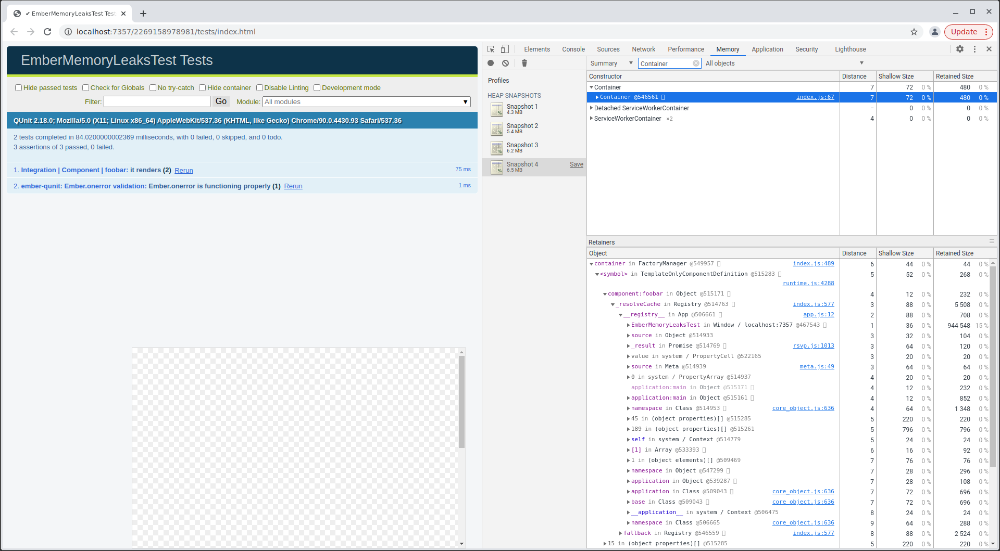
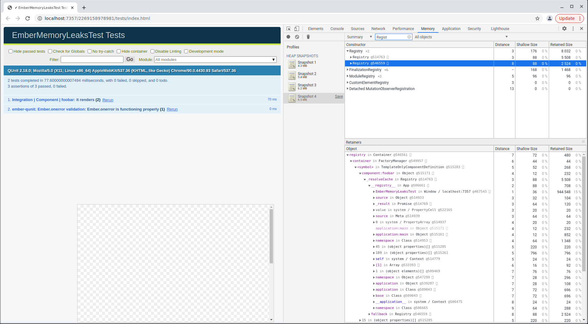

# ember-memory-leaks-test

This is a reproduction case demonstrating memory leaks in a freshly generated Ember 3.28.8.

## Reproduction steps

- Run `$ npm run test:ember -- --serve`
- Open Chrome dev tools on the Memory tab
- Take a Heap snapshot
- Reload the page
- Take another Heap snapshot

## Issue description

On every test run the Heap snapshot keeps getting bigger.

You can noticed that the `Container` is still present and is not garbage collected.

There is also 2 `Registry`:

